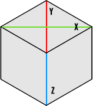

## The main snippets for working with isometric dimensions

* [Definitions](https://github.com/neki-dev/isometric-snippets?tab=readme-ov-file#definitions)
* [Render](https://github.com/neki-dev/isometric-snippets?tab=readme-ov-file#render)
  * [Get depth](https://github.com/neki-dev/isometric-snippets?tab=readme-ov-file#get-depth)
* [Conversion](https://github.com/neki-dev/isometric-snippets?tab=readme-ov-file#conversion)
  * [Convert matrix position to world position](https://github.com/neki-dev/isometric-snippets?tab=readme-ov-file#convert-matrix-position-to-world-position)
  * [Convert world position to matrix position](https://github.com/neki-dev/isometric-snippets?tab=readme-ov-file#convert-world-position-to-matrix-position)
  * [Convert world position to screen position](https://github.com/neki-dev/isometric-snippets?tab=readme-ov-file#convert-world-position-to-screen-position)
* [Math](https://github.com/neki-dev/isometric-snippets?tab=readme-ov-file#math)
  * [Get distance](https://github.com/neki-dev/isometric-snippets?tab=readme-ov-file#get-distance)
  * [Get angle](https://github.com/neki-dev/isometric-snippets?tab=readme-ov-file#get-angle)

.

# Definitions



* TILE_X (green)
* TILE_Y (red)
* TILE_Z (blue)

* PERSPECTIVE = TILE_Y / TILE_X

# Render

### Get depth
```js
function depth(positionAtWorld) {
  return positionAtWorld.y + positionAtWorld.z;
}
```

# Conversion

### Convert matrix position to world position
```js
function matrixToWorld(positionAtMatrix) {
  const halfSize = {
    x: TILE_X / 2,
    y: TILE_Y / 2,
  };

  return {
    x: (positionAtMatrix.x - positionAtMatrix.y) * halfSize.x,
    y: (positionAtMatrix.x + positionAtMatrix.y) * halfSize.y,
    z: positionAtMatrix.z * TILE_Z,
  };
}
```

### Convert world position to matrix position
```js
function worldToMatrix(positionAtWorld) {
  const halfSize = {
    x: TILE_X / 2,
    y: TILE_Y / 2,
  };
  const n = {
    x: positionAtWorld.x / halfSize.x,
    y: positionAtWorld.y / halfSize.y,
  };

  return {
    x: Math.round((n.x + n.y) / 2),
    y: Math.round((n.y - n.x) / 2),
    z: Math.floor(positionAtWorld.z / TILE_Z),
  };
}
```

### Convert world position to screen position
```js
function worldToScreen(positionAtWorld) {
  return {
    x: positionAtWorld.x,
    y: positionAtWorld.y - positionAtWorld.z,
  };
}
```

# Math

### Get isometric distance (for world positions)
```js
function distance(from, to) {
  return Math.hypot(
    (to.x - from.x),
    (to.y - from.y) / PERSPECTIVE,
  );
}
```

### Get isometric angle (for world positions)
```js
function angle(from, to) {
  return Math.atan2(
    (to.y - from.y) / PERSPECTIVE,
    (to.x - from.x),
  );
}
```
